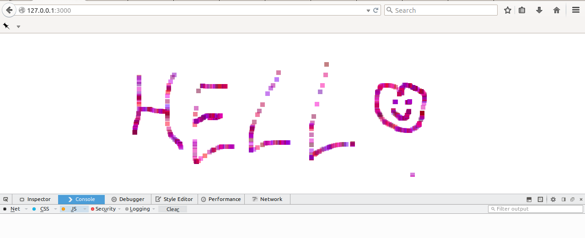

kidColor
========
Basic interactive drawing program utilizing `canvas` element.
-------------------------------------------------------------

> A simple, user-interactive drawing program. A nice use of the canvas element in HTML5 and mouse events. It's cool!
